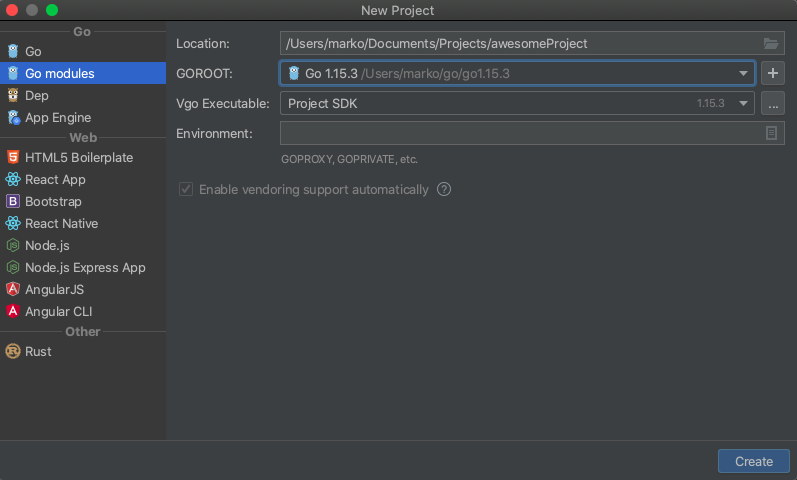

# Go presentation material

Workshop code for introduction to Go programming language.

   

## Setup
1. Install Go for
    1. Linux, Mac or Windows via [Official install website](https://golang.org/doc/install) 
    2. or for Mac via [HomeBrew](https://formulae.brew.sh/formula/go)
    3. Verify via `go version`
     
2. Installation 
    - JetBrains IDE [GoLand](https://www.jetbrains.com/go/)
    - or VSCode with [Go plugin](https://code.visualstudio.com/docs/languages/go)
        - Init the project directory with `go mod init directory_name` directory_name is usually the project name
        - Run `cmd + shift + p` to open command pallet, select `Go: Install/Update Tools` and check all 
        - More info in this [YouTube tutorial](https://www.youtube.com/watch?v=TfCMweSHWHw) 

            
    
3. Create a single `main.go` file in the root directory

4. Commands (check `Makefile` for more info)
    - Run `make run`
    - Install `make install`
    - Build `make`
    - Format `make format`
    - Test `make test`
    - Compile `make compile` (build for specific OS) 

## Learning references

During exercises you can refer to following sheets:
 - [Go cheatsheet](https://devhints.io/go)
 - [Gy by example](https://gobyexample.com/)
 - [Go project layout](https://github.com/golang-standards/project-layout)
 
Learning references:
 - `Go in action` ebook
 - `Go programming blueprints` ebook

## Plan
Summary of the planned presentation.

1. Introduction
    1. Variables and basic types
    2. Structs
    3. Pointers
    4. Type conversion
    5. Arrays, slices
    6. Maps
    7. if, switch, loop, range
    8. Functions, lambdas, multiple return types and methods
    9. Error handling and defer
    10. Interfaces and composition
    11. Testing and benchmarking
2. Simple exercise, process a JSON file
3. Concurrency
    1. Goroutines
    2. WaitGroup and mutex
    3. Channels (Buffered and UnBuffered) and select statement
    4. HTTP server
4. Simple exercise, HackerNews API processing


## Exercises
Following exercises are aimed to be simple and more of an introduction to the language.

### 1. Movie json parsing and calculating
#### Description
Read and parse the json data from the movies file, find movies and group them via IMDB votes, 
so it's in the following order (IMDB rating is from 0.0 to 10.0):
 - Best (8-10)
 - Good (6-8)
 - Ok (4-6)
 - Bad (2-4)
 - Terrible (0-2)

Application should output at the end in the following format:
```text
Best:
 count:
 top_movie:
 us_gross: 
 world_wide_gross:
 total_gross:

Good:
 count:
 top_movie:
 us_gross: 
 world_wide_gross:
 total_gross:

Ok:
 count:
 top_movie:
 us_gross: 
 world_wide_gross:
 total_gross:

Bad:
 count:
 top_movie:
 us_gross: 
 world_wide_gross:
 total_gross:

Terrible:
 count: 
 top_movie:
 us_gross: 
 world_wide_gross:
 total_gross:
-------------------
Genre types
 - First type
 - Second type
 - etc
```

#### Additional info

Data for the first exercise is located in `data/movies.json` as array with the following **json** movie format:
```json
{
    "Title": "string",
    "US Gross": 0,
    "Worldwide Gross": 0,
    "US DVD Sales": 0,
    "Production Budget": 0,
    "Release Date": "",
    "MPAA Rating":"R",
    "Running Time min": 0,
    "Distributor": "",
    "Source": "",
    "Major Genre": "",
    "Creative Type": "",
    "Director": "",
    "Rotten Tomatoes Rating": 0,
    "IMDB Rating": 0,
    "IMDB Votes": 0
}
```

### 2. HTTP server

Create HTTP server with single endpoint to retrieve a resource which is fetched from 
[HackerNewsAPI](https://github.com/HackerNews/API) and cache that resource if it exists by id. Bonus would be to add 
cache expiration.

Acceptance Criteria:
 - Create endpoint /item/:id which will return response of `https://hacker-news.firebaseio.com/v0/item/8863.json`
 - Response must be in json format
 - Synchronize caching, eg read and set
 - Bonus: cache should expire after a time limit has passed since setting the value
